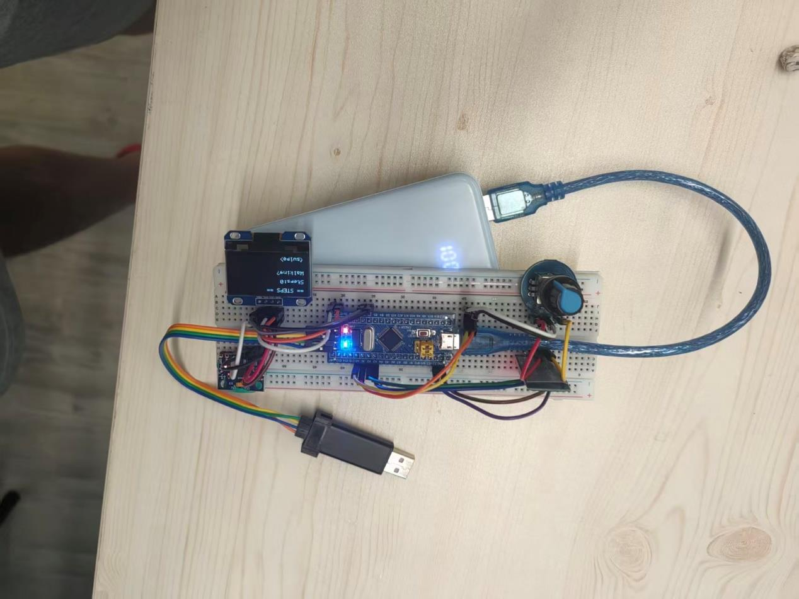

# 课设物料清单

该 PDF 为课程设计所需物料的采购清单截图。

## 识别到的内容

- **订单/课程编号**: 3124009605
- **主控**: STM32
- **显示屏**: 1.3寸 OLED (I2C接口)
- **面包板**: 830孔
- **传感器**: MPU-6050 (六轴陀螺仪+加速度计)
- **金额**: ¥42.98 + ¥21.49
- **通信**: I2C (SDA, SCL)
- **RTC(可选)**: DS3231 时钟模块

## 原始图片

PDF 为截图格式，见附件图片：

